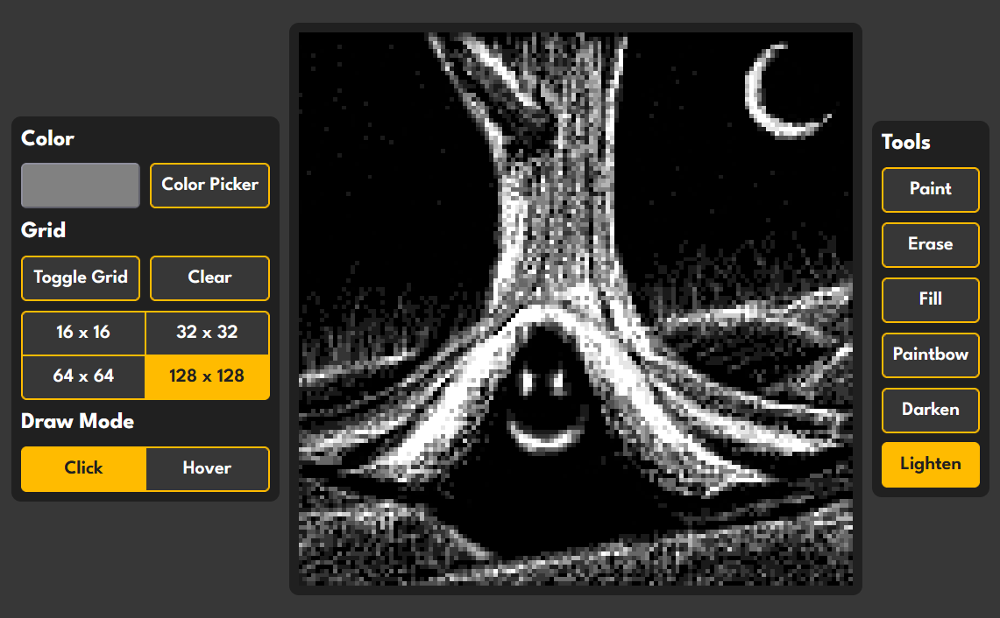

# odin-etch-a-sketch
Etch-a-Sketch project from The Odin Project in the JavaScript Basics section of the Foundations course. Thanks to [CHKiens](https://github.com/CHKiens) for trying out the project and making the drawing seen in the preivew below!

## Demonstrated skills

- Git and GitHub

- JavaScript

- HTML

- CSS

## Considered Improvements

- Smooth color change in paintbow mode

- Make fill tool work with rainbow mode

- Save drawing as image

- Responsive layout when window width is less than height
